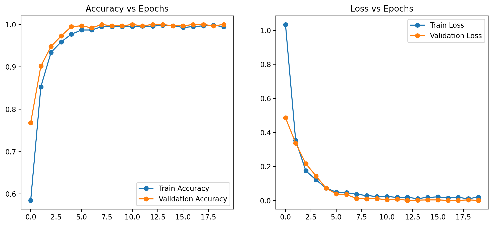
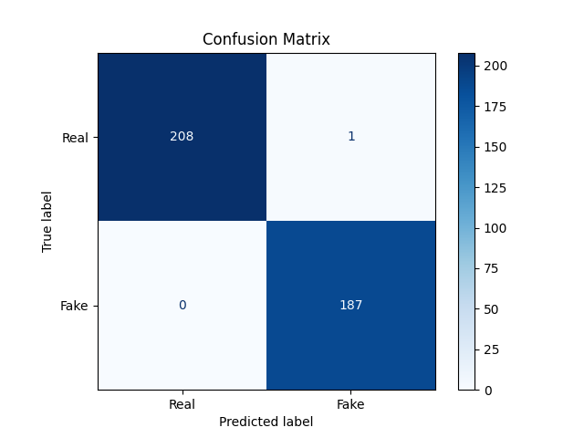
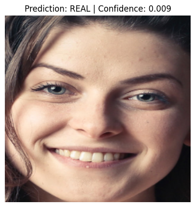

# Deepfake Detection using VGG16 and MTCNN

Deepfake Detection using Transfer Learning with VGG16 and MTCNN for face extraction.
This project performs image classification to determine whether a given face image is Real or Fake (Deepfake) with high accuracy.

## Table of Contents

 1.⁠ ⁠[Introduction](#introduction)
 
 2.⁠ ⁠[Dataset Structure](#dataset-structure)
 
 3.⁠ ⁠[Model Architecture](#model-architecture)
 
 4.⁠ ⁠[Training Results](#training-results)
 
 5.⁠ ⁠[Training Curves](#training-curves)
 
 6.⁠ ⁠[Confusion Matrix](#confusion-matrix)
 
 7.⁠ ⁠[Example Prediction](#example-prediction)
 
 8.⁠ ⁠[Installation](#installation)
 
 9.⁠ ⁠[Usage](#usage)
 
10.⁠ ⁠[Requirements](#requirements)

11.⁠ ⁠[Future Work](#future-work)

12.⁠ ⁠[Contributors](#contributors)

# Introduction

Deepfakes are synthetic images or videos where a person’s likeness is replaced using artificial intelligence. This project implements a system to classify facial images as either Real or Fake using deep learning.

The workflow includes face extraction with MTCNN, feature learning with VGG16 pretrained on ImageNet, and a custom classification head for final prediction.

# Dataset Structure
~~~
Deepfake-detection-vgg16/
│
├── archive/
│   ├── real_and_fake_face/
│   │   ├── training_real/
│   │   └── training_fake/
│
└── test_dataset/
    ├── real/
    └── fake/
~~~
# Model Architecture

The model uses transfer learning:

## Base Model:

* VGG16 (weights pretrained on ImageNet)

* Convolutional layers frozen

## Classification Head:

* Flatten

* Batch Normalization

* Dense (1024 units, ReLU)

* Dropout (0.5)

* Output Dense (1 unit, Sigmoid)

# Training Results

The model demonstrated strong performance:
| Metric              | Score           |
| ------------------- | --------------- |
| Training Accuracy   | ~99%            |
| Validation Accuracy | ~99–100%        |
| Training Loss       | Low, decreasing |
| Validation Loss     | Very low        |

# Training Curves

Plots showing accuracy and loss per epoch:

---

# Confusion Matrix

Confusion Matrix on test data:

---

# Example Prediction

Sample output given an input image:

Prediction: REAL  
Confidence: 0.004

# Installation

Clone the repository:
git clone https://github.com/Sadique31/deepfake-detection-vgg16.git
cd deepfake-detection-vgg16

Set up virtual environment:
python3 -m venv deepfake
source deepfake/bin/activate

Install dependencies:

pip install -r requirements.txt

# Usage
Train Model

python train.py

# Requirements

* Python 3.8 or higher

* TensorFlow / Keras

* OpenCV

* MTCNN

* NumPy

* Matplotlib

* Scikit-learn

# Future Work

* Real-time webcam deepfake detection

* Video-based deepfake analysis

* Model optimization for faster inference

# Author

*Sadique Nomani*  
B.Tech Computer Science Engineering  
Project Lead

---

# Contributors

•⁠  ⁠*Mayank Pandey*  
•⁠  ⁠Mansi Jain  
•⁠  ⁠Vaishali Negi  
•⁠  ⁠Vasudha Sharma  

---

This project demonstrates the application of face-based preprocessing using *MTCNN* and transfer learning with *VGG16* for high-accuracy deepfake image detection.
